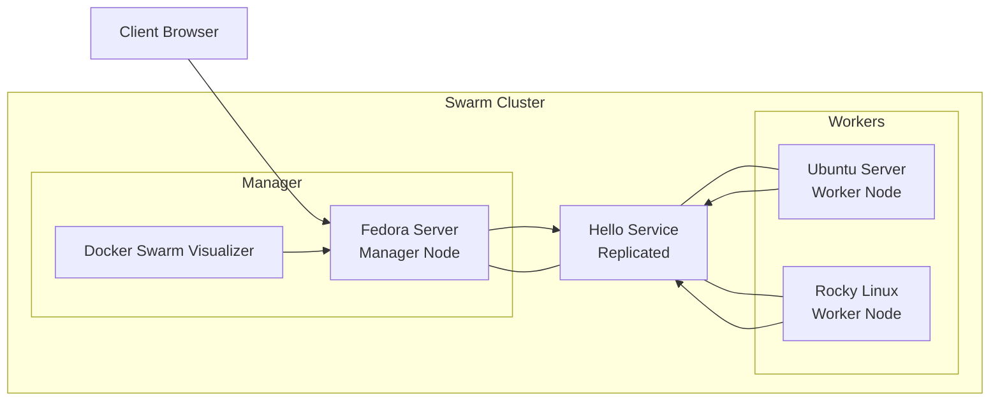
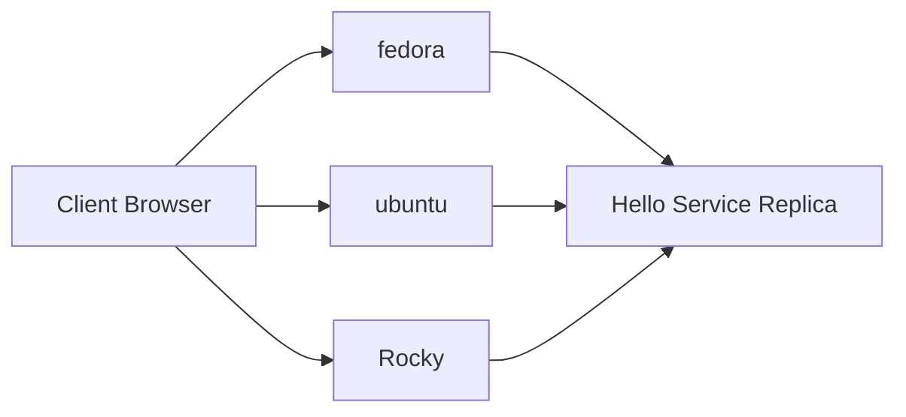

# Docker Swarm Cluster

<p align="center">


</p>

---

# Table of Contents

- [Overview](#overview)
- [Features](#features)
- [Architecture](#architecture)
- [Lab Environment](#lab-environment)
- [Project Structure](#project-structure)
- [Prerequisites](#prerequisites)
- [Building the Swarm Cluster](#building-the-swarm-cluster)
  - [Step 1 — Initialize the Manager Node](#step-1--initialize-the-manager-node)
  - [Step 2 — Retrieve the Worker Join Token](#step-2--retrieve-the-worker-join-token)
  - [Step 3 — Join the Worker Nodes](#step-3--join-the-worker-nodes)
  - [Step 4 — Verify the Cluster](#step-4--verify-the-cluster)
- [Docker Swarm Visualizer](#docker-swarm-visualizer)
  - [Deploy the Visualizer](#deploy-the-visualizer)
- [Creating the Overlay Network](#creating-the-overlay-network)
  - [Create the Overlay Network](#create-the-overlay-network)
- [Deploying the Hello Service](#deploying-the-hello-service)
  - [Create the Service](#create-the-service)
  - [Inspect the Service Definition](#inspect-the-service-definition)
- [Docker Swarm Routing Mesh](#docker-swarm-routing-mesh)
  - [How Routing Mesh Works](#how-routing-mesh-works)
  - [Demonstrating the Routing Mesh](#demonstrating-the-routing-mesh)
- [High Availability](#high-availability)
  - [Drain the Ubuntu Worker](#drain-the-ubuntu-worker)
  - [Restore the Node](#restore-the-node)
- [Scaling the Service](#scaling-the-service)
  - [Increase the Number of Replicas](#increase-the-number-of-replicas)
  - [Reduce the Number of Replicas](#reduce-the-number-of-replicas)
- [Rolling Updates](#rolling-updates)
  - [Perform a Rolling Update](#perform-a-rolling-update)
- [Rollback](#rollback)
  - [Roll Back the Previous Update](#roll-back-the-previous-update)
- [Deploying with Docker Stack](#deploying-with-docker-stack)
  - [Remove the Existing Service](#remove-the-existing-service)
  - [Review the Stack File](#review-the-stack-configuration)
  - [Deploy the Stack](#deploy-the-stack)
- [Troubleshooting](#troubleshooting)
- [Cleanup](#cleanup)
- [Key Takeaways](#key-takeaways)
- [License](#license)

---

# Overview

This project demonstrates how to build and operate a **Docker Swarm cluster** consisting of one manager node and two worker nodes.

Instead of focusing only on cluster creation, the project walks through the complete lifecycle of deploying and managing a distributed application. It covers service deployment, overlay networking, routing mesh, high availability, automatic task rescheduling, scaling, rolling updates, rollback, and declarative deployments using Docker Stack.

The project was built in a real multi-VM lab environment using Fedora Server, Ubuntu Server, and Rocky Linux Minimal, making it suitable for anyone who wants hands-on experience with Docker Swarm orchestration.

By the end of this project, readers will understand not only how to create a Swarm cluster, but also how Docker Swarm schedules workloads, maintains service availability, and manages applications across multiple Linux hosts.

---

# Features

- Build a Docker Swarm cluster with one manager and two worker nodes
- Deploy services across multiple Linux hosts
- Create and use overlay networks
- Deploy and manage replicated services
- Understand Docker Swarm Routing Mesh
- Demonstrate high availability through node draining
- Observe automatic task rescheduling
- Scale services up and down
- Perform rolling updates with zero downtime
- Roll back failed deployments
- Deploy applications using Docker Stack
- Compare imperative and declarative deployment models
- Learn core Docker Swarm concepts through practical examples

---

# Architecture

The project is built around a **three-node Docker Swarm cluster** consisting of one manager node and two worker nodes.

The manager node is responsible for cluster management, scheduling tasks, and maintaining the desired state of the cluster, while the worker nodes execute application workloads.

To visualize the cluster in real time, a Docker Swarm Visualizer service is deployed on the manager node. The application itself is deployed as a replicated service across the cluster and communicates through an overlay network.



---

## Components

### Fedora Server (Manager)

The Fedora Server VM acts as the **Docker Swarm manager**. It is responsible for:

- Initializing the Swarm cluster
- Managing cluster membership
- Scheduling service tasks
- Maintaining the cluster's desired state
- Hosting the Docker Swarm Visualizer

---

### Ubuntu Server (Worker)

The Ubuntu Server VM joins the cluster as a **worker node**.

Its primary responsibility is executing application containers assigned by the manager.

---

### Rocky Linux Minimal (Worker)

The Rocky Linux VM serves as the second worker node.

Using a different Linux distribution demonstrates that Docker Swarm clusters can consist of heterogeneous Linux hosts.

---

### Docker Swarm Visualizer

The Visualizer provides a real-time graphical view of the cluster.

Throughout this project it is used to observe:

- service placement
- task scheduling
- replica distribution
- node availability
- rolling updates
- automatic task rescheduling

The Visualizer is deployed separately from the application because it is considered part of the cluster's operational tooling rather than the application itself.

---

### Overlay Network

An overlay network enables containers running on different Swarm nodes to communicate as if they were connected to the same local network.

The Hello service is attached to this overlay network, allowing replicas to communicate regardless of which node they are running on.

---

### Hello Service

The demonstration application is deployed using the **nginxdemos/hello** image.

Multiple replicas of the service are distributed across the cluster to demonstrate:

- task scheduling
- Routing Mesh
- high availability
- scaling
- rolling updates
- rollback

---

# Lab Environment

The project was implemented and tested in a virtualized lab consisting of three Linux virtual machines running Docker Engine and connected through a private network.

The cluster uses one manager node and two worker nodes to demonstrate Docker Swarm orchestration features such as service scheduling, routing mesh, high availability, scaling, and rolling updates.

## Virtual Machines

| Hostname | Operating System | Swarm Role | vCPU | RAM |
|----------|------------------|------------|-----:|----:|
| **fedora** | Fedora Server | Manager | 2 | 2 GB |
| **ubuntu** | Ubuntu Server | Worker | 2 | 2 GB |
| **Rocky** | Rocky Linux Minimal | Worker | 1 | 1 GB |

---

## Software

| Software | Purpose |
|----------|---------|
| Docker Engine | Container runtime |
| Docker Swarm | Container orchestration |
| Docker Swarm Visualizer | Cluster visualization |
| nginxdemos/hello | Demonstration application |

---

## Network Topology

```text
                   Docker Swarm Cluster

                   +----------------+
                   |    fedora      |
                   |    Manager     |
                   +----------------+
                     /            \
                    /              \
                   /                \
        +----------------+   +----------------+
        |    ubuntu      |   |     Rocky      |
        |    Worker      |   |     Worker     |
        +----------------+   +----------------+
```

All three virtual machines communicate over the same network, allowing Docker Swarm to manage workloads across the cluster.

The demonstration application is deployed as a replicated service attached to an overlay network, enabling containers running on different hosts to communicate transparently.

---

# Project Structure

```text
docker-swarm-cluster/
│
├── docs/
│   ├── diagrams/
│   └── screenshots/
│
├── stack/
│   └── hello-stack.yml
│
├── .gitignore
├── LICENSE
└── README.md
```

## Directory Layout

### `docs/`

Contains all documentation assets used throughout the project.

#### `docs/diagrams/`

Stores architecture diagrams and illustrations that explain Docker Swarm concepts such as cluster topology, overlay networking, routing mesh, and rolling updates.

#### `docs/screenshots/`

Contains screenshots captured during the implementation. These images are referenced throughout the README to demonstrate cluster deployment, service scheduling, scaling, high availability, and Docker Stack deployment.

---

### `stack/`

Contains the Docker Stack configuration used for the declarative deployment section of the project.

#### `hello-stack.yml`

Defines the Hello application as a Docker Stack, allowing the service to be deployed declaratively instead of using imperative `docker service` commands.

---

### `.gitignore`

Specifies files and directories that should not be tracked by Git.

This prevents temporary files, editor settings, and other unnecessary artifacts from being committed to the repository.

---

### `LICENSE`

Defines the licensing terms for the repository.

This project is distributed under the MIT License.

---

### `README.md`

The main project documentation.

It contains:

- project overview
- architecture
- deployment guide
- Docker Swarm concepts
- troubleshooting
- cleanup instructions
- references
```

---

# Prerequisites

Before following this guide, ensure the following requirements are met.

## Required Knowledge

This project assumes a basic understanding of:

- Linux command-line usage
- Docker fundamentals (images, containers, and networks)
- Basic networking concepts (IP addresses and ports)

No prior Docker Swarm experience is required.

---

## Software Requirements

Install the following software on each virtual machine:

- Docker Engine
- Docker CLI

Docker Swarm is included with Docker Engine and does not require a separate installation.

---

## Lab Requirements

To reproduce this project, prepare:

- Three Linux virtual machines
- Network connectivity between all nodes
- One node designated as the Swarm manager
- Two nodes designated as Swarm workers

The virtual machines used in this project are:

| Hostname | Role |
|----------|------|
| **fedora** | Manager |
| **ubuntu** | Worker |
| **Rocky** | Worker |

---

## User Permissions

The commands shown throughout this guide are executed as the **root** user.

If using a non-root account, either:

- run Docker commands with `sudo`, or
- configure Docker to allow execution without `sudo`.

---

## Internet Access

Internet connectivity is required during the deployment process to pull container images from Docker Hub.

---

# Building the Swarm Cluster

In this section, we'll create a Docker Swarm cluster consisting of one manager node and two worker nodes.

The process consists of four steps:

1. Initialize the Swarm on the manager node.
2. Obtain the worker join token.
3. Join both worker nodes to the cluster.
4. Verify the cluster.

Once completed, the three virtual machines will operate as a single Docker Swarm cluster capable of scheduling and managing containerized workloads.

## Step 1 — Initialize the Manager Node

The first step is to initialize Docker Swarm on the manager node.

Run the following command on **fedora**.

```bash
docker swarm init --advertise-addr <manager-ip>
```

Example:

```bash
docker swarm init --advertise-addr 192.168.190.128
```

### Command Breakdown

#### `docker swarm init`

Initializes a new Docker Swarm cluster.

This command converts the local Docker Engine into the **manager node**, enabling it to manage the cluster and schedule workloads.

---

#### `--advertise-addr`

Specifies the IP address that other nodes should use when communicating with the manager.

This should be an address that is reachable by all worker nodes.

In this project:

```text
192.168.190.128
```

is the IP address of the **fedora** manager node.

---

### Expected Output

Docker initializes the cluster and displays information similar to the following:

```text
Swarm initialized: current node (...) is now a manager.

To add a worker to this swarm, run the following command:

docker swarm join \
--token SWMTKN-... \
192.168.190.128:2377
```

The join command displayed here will be used by the worker nodes in the next step.

### Verify the Manager

Run:

```bash
docker info
```

Look for:

```text
Swarm: active
```

This confirms that Docker Swarm has been successfully initialized on the manager node.

### Why This Step Matters

A Docker Swarm cluster always begins with a manager node.

The manager is responsible for:

- maintaining the cluster state,
- accepting new nodes,
- scheduling service tasks,
- orchestrating deployments,
- monitoring node health.

Without a manager node, Docker Swarm cannot coordinate workloads across multiple hosts.

---

## Step 2 — Retrieve the Worker Join Token

If you no longer have the output from `docker swarm init`, you can retrieve the worker join token at any time.

Run the following command on the manager node.

```bash
docker swarm join-token worker
```

### What This Command Does

Docker Swarm generates separate join tokens for:

- worker nodes
- manager nodes

In this project we only need the **worker** token because the cluster consists of one manager and two workers.

The command prints the exact `docker swarm join` command required by worker nodes.

### Expected Output

The command displays a join command similar to:

```bash
docker swarm join \
--token SWMTKN-... \
192.168.190.128:2377
```

Copy this command, as it will be executed on both worker nodes in the next step.

---

## Step 3 — Join the Worker Nodes

Execute the worker join command on both **ubuntu** and **Rocky**.

The command is obtained from the manager node using:

```bash
docker swarm join-token worker
```

Example:

```bash
docker swarm join \
    --token SWMTKN-1-xxxxxxxxxxxxxxxxxxxxxxxx \
    192.168.190.128:2377
```

Run this command once on **ubuntu** and once on **Rocky**.

### Command Breakdown

#### `docker swarm join`

Joins an existing Docker Swarm cluster.

Unlike `docker swarm init`, this command does **not** create a new cluster. Instead, it connects the current Docker Engine to an existing Swarm managed by another node.

---

#### `--token`

Specifies the worker join token.

Docker Swarm uses this token to authenticate new nodes before allowing them to join the cluster.

Separate tokens exist for:

- worker nodes
- manager nodes

---

#### `192.168.190.128:2377`

This specifies the manager node that the worker will contact.

- `192.168.190.128` is the manager's IP address.
- `2377` is Docker Swarm's cluster management port.

### Expected Output

After running the command successfully, Docker displays:

```text
This node joined a swarm as a worker.
```

Repeat the same procedure on the second worker node.

---

## Step 4 — Verify the Cluster

Return to the **fedora** manager node and list all Swarm members.

```bash
docker node ls
```

Expected output:

```text
ID                            HOSTNAME   STATUS   AVAILABILITY   MANAGER STATUS

xxxxxxxxxxxx                  fedora     Ready    Active         Leader
xxxxxxxxxxxx                  ubuntu     Ready    Active
xxxxxxxxxxxx                  Rocky      Ready    Active
```

### Understanding the Output

#### `STATUS`

Indicates whether the node is currently communicating with the cluster.

A healthy node should report:

```text
Ready
```

---

#### `AVAILABILITY`

Determines whether Docker Swarm can schedule workloads on the node.

Possible values include:

- `Active`
- `Pause`
- `Drain`

Throughout this project we'll demonstrate how changing this value affects service placement.

---

#### `MANAGER STATUS`

This field is only populated for manager nodes.

In this project:

```text
Leader
```

indicates that **fedora** is currently the leader of the Swarm cluster.

### Verify from a Worker Node

On either **ubuntu** or **Rocky**, run:

```bash
docker info
```

Look for:

```text
Swarm: active
NodeID: ...
```

This confirms that the worker has successfully joined the cluster.

### Why This Step Matters

At this point, the Docker Swarm cluster is fully operational.

Although the three virtual machines remain physically separate, Docker Swarm now manages them as a single logical cluster.

From this point onward:

- services can be scheduled across multiple nodes,
- workloads can be replicated,
- containers can communicate through overlay networks,
- and Docker Swarm can automatically recover from node availability changes.

### Summary

In this section you learned how to:

- initialize a Docker Swarm manager,
- retrieve the worker join token,
- join worker nodes to the cluster,
- verify cluster membership,
- interpret the output of `docker node ls`.

The next section introduces the **Docker Swarm Visualizer**, which provides a real-time graphical view of service placement and task scheduling throughout the remainder of this project.

> **Note** 
>
> Worker nodes cannot manage the cluster. Commands such as docker node ls, docker service create, and docker service update must be executed on a manager node. Worker nodes areresponsible for running workloads assigned by the manager.

---

# Docker Swarm Visualizer

Managing a Docker Swarm cluster from the command line is straightforward, but it can be difficult to visualize where services are running as the cluster grows.

To make the scheduling behavior easier to understand, we'll deploy the **Docker Swarm Visualizer**.

The Visualizer provides a real-time graphical representation of:

- cluster nodes
- running services
- task placement
- replica distribution
- node availability

Throughout the remainder of this project, the Visualizer will be used to observe how Docker Swarm responds to scaling operations, node availability changes, rolling updates, and other orchestration events.

## Deploy the Visualizer

Run the following command on the **fedora** manager node.

```bash
docker service create \
    --name visualizer \
    --publish 8080:8080 \
    --constraint node.role==manager \
    --mount type=bind,src=/var/run/docker.sock,dst=/var/run/docker.sock \
    dockersamples/visualizer:stable
```

### Command Breakdown

#### `docker service create`

Creates a new Docker Swarm service.

Unlike `docker run`, services are managed by Docker Swarm and can be scheduled across multiple nodes.

---

#### `--name visualizer`

Assigns the name **visualizer** to the service.

---

#### `--publish 8080:8080`

Publishes port **8080** on the Swarm cluster.

The Visualizer can then be accessed through:

```text
http://<manager-ip>:8080
```

---

#### `--constraint node.role==manager`

Restricts the service to manager nodes.

The Visualizer communicates with the Docker API and therefore should only run on the manager.

---

#### `--mount`

```text
type=bind
```

Creates a bind mount.

```text
src=/var/run/docker.sock
```

Specifies the Docker socket on the host.

```text
dst=/var/run/docker.sock
```

Makes the socket available inside the container.

This allows the Visualizer to communicate with the local Docker Engine and retrieve information about the Swarm cluster.

---

#### `dockersamples/visualizer:stable`

Specifies the container image used to run the Visualizer.

---

## Verify the Deployment

List the running services.

```bash
docker service ls
```

Expected output:

```text
NAME         MODE         REPLICAS

visualizer   replicated   1/1
```

Inspect the task placement.

```bash
docker service ps visualizer
```

The task should be running on the **fedora** manager node.

---

## Access the Visualizer

Open a web browser and navigate to:

```text
http://192.168.190.128:8080
```

Replace the IP address with the address of your own manager node if necessary.

The Visualizer should display the three-node Swarm cluster.

> 📸 **Screenshot 2**  
> Docker Swarm Visualizer immediately after deployment.

### Why This Step Matters

The Visualizer is not part of the application deployed in this project.

Instead, it serves as an operational tool that helps us observe Docker Swarm's scheduling decisions in real time.

From this point forward, the Visualizer will be used throughout the project to illustrate:

- service deployment
- replica placement
- routing mesh demonstrations
- node draining
- automatic task rescheduling
- service scaling
- rolling updates
- rollback

---

## Troubleshooting

### The Visualizer service is repeatedly rejected

If `docker service ps visualizer` shows repeated task failures such as:

```text
No such image: dockersamples/visualizer:latest
```

the requested image tag may no longer be available.

Pull the supported image manually:

```bash
docker pull dockersamples/visualizer:stable
```

Then recreate the service using the `stable` tag.

---

## Troubleshooting

### The Visualizer service is repeatedly rejected

If `docker service ps visualizer` shows repeated task failures such as:

```text
No such image: dockersamples/visualizer:latest
```

the requested image tag may no longer be available.

Pull the supported image manually:

```bash
docker pull dockersamples/visualizer:stable
```

Then recreate the service using the `stable` tag.

---

### Understanding Overlay Networks

Docker supports several network drivers, each designed for different use cases.

| Driver | Scope | Typical Use |
|---------|-------|-------------|
| **bridge** | Single host | Standalone containers |
| **host** | Single host | Maximum network performance |
| **none** | Single host | No networking |
| **overlay** | Multiple hosts | Docker Swarm services |

An overlay network creates a virtual network that spans every node in the Swarm cluster.

As a result, service replicas can communicate regardless of which physical machine they are running on.

### Why Create the Network Manually?

Docker Stack can automatically create overlay networks during deployment.

However, in this project we create the network manually for two reasons:

1. It introduces overlay networking as an independent Docker Swarm concept.
2. The same network can later be reused by both the imperative service deployment and the declarative Docker Stack deployment.

This makes the transition from imperative to declarative deployment much easier to understand.

### Verify from a Worker Node

On either **ubuntu** or **Rocky**, run:

```bash
docker network ls
```

You may notice that the overlay network does **not** immediately appear.

This is expected behavior.

Docker Swarm creates the network on worker nodes only when a service running on that node requires it.

### Summary

In this section you learned how to:

- create an overlay network,
- verify its creation,
- understand the purpose of overlay networking,
- distinguish overlay networks from other Docker network drivers,
- prepare the cluster for application deployment.

The next section deploys the Hello application as a replicated Docker Swarm service using imperative commands.

---

# Deploying the Hello Service

With the Swarm cluster and overlay network in place, we can now deploy our first distributed application.

Throughout this project, we'll use the **nginxdemos/hello** image as a lightweight demonstration application.

Unlike a standalone container, a Docker Swarm service is managed by the cluster. Docker continuously monitors the service and ensures that the desired number of replicas remain available.

## Create the Service

Run the following command on the **fedora** manager node.

```bash
docker service create \
    --name hello \
    --replicas 3 \
    --network swarm-net \
    --publish 80:80 \
    nginxdemos/hello
```

### Command Breakdown

#### `docker service create`

Creates a Docker Swarm service.

Unlike `docker run`, services are managed by Docker Swarm and can be scheduled across multiple nodes.

---

#### `--name hello`

Assigns the service name **hello**.

---

#### `--replicas 3`

Requests three running instances of the application.

Docker Swarm automatically distributes these replicas across the available nodes whenever possible.

---

#### `--network swarm-net`

Connects every replica to the previously created overlay network.

---

#### `--publish 80:80`

Publishes port **80** through Docker Swarm's Routing Mesh.

As a result, the application can be accessed from **any node** in the cluster.

---

#### `nginxdemos/hello`

Specifies the container image to deploy.

## Verify the Deployment

List all services.

```bash
docker service ls
```

Expected output:

```text
NAME         MODE         REPLICAS

hello        replicated   3/3
visualizer   replicated   1/1
```

Run:

```bash
docker service ps hello
```

Example:

```text
NAME      IMAGE                NODE      DESIRED STATE   CURRENT STATE

hello.1   nginxdemos/hello     fedora    Running         Running
hello.2   nginxdemos/hello     ubuntu    Running         Running
hello.3   nginxdemos/hello     Rocky     Running         Running
```

### Understanding the Output

Each line represents a **task**.

A task is Docker Swarm's representation of an individual service replica.

In this example:

- one replica is running on **fedora**
- one replica is running on **ubuntu**
- one replica is running on **Rocky**

Docker Swarm automatically selected where each replica should run.

## Inspect the Service Definition

Docker Swarm stores the desired configuration of every service.

To inspect the service specification, run:

```bash
docker service inspect hello
```

The output is returned in JSON format and contains the complete service definition maintained by the Swarm manager.

For a more readable summary, use:

```bash
docker service inspect --pretty hello
```

## Service vs Task vs Container

Docker Swarm introduces a few new concepts.

| Object | Description |
|---------|-------------|
| **Service** | The desired application definition managed by Docker Swarm. |
| **Task** | A scheduled instance of a service. Each replica corresponds to one task. |
| **Container** | The actual running container created to execute a task. |

In other words:

```text
Service
    ↓
Tasks (replicas)
    ↓
Containers
```

Docker Swarm manages services.

Services create tasks.

Tasks run containers.

## Observe the Visualizer

Refresh the Docker Swarm Visualizer in your browser.

You should now see the **hello** service distributed across the cluster.

> 📸 **Screenshot 3**  
> Visualizer showing the Hello service running on multiple nodes.

## Access the Application

Open a web browser and visit any node in the cluster.

For example:

```text
http://192.168.190.128
```

or

```text
http://<ubuntu-ip>
```

or

```text
http://<rocky-ip>
```

The Hello application should be displayed successfully.

We'll explain **why** every node responds in the next section when we explore Docker Swarm's Routing Mesh.

## Compare with `docker ps`

Run the following command on each node.

```bash
docker ps
```

Notice that each machine only displays the containers that are actually running on **that node**.

Unlike `docker service ps`, which shows the entire service across the cluster, `docker ps` displays only the local Docker Engine.

### Why This Step Matters

At this point, the cluster is running a real distributed application.

You have learned how to:

- create a replicated service,
- inspect service status,
- view individual tasks,
- understand the relationship between services, tasks, and containers,
- observe task placement using the Visualizer.

The next section introduces one of Docker Swarm's most important features: **Routing Mesh**, which allows the application to be accessed through any node in the cluster, regardless of where individual replicas are running.

### Understanding the Output

The formatted output displays the service configuration in a human-readable format.

Among other information, you'll find:

- Service name
- Service mode (Replicated)
- Number of replicas
- Published ports
- Connected networks
- Placement constraints (if configured)
- Container image

Example:

```text
Name:           hello
Mode:           Replicated
 Replicas:      3
Image:          nginxdemos/hello:latest
Ports:
 PublishedPort = 80
  Protocol = tcp
  TargetPort = 80
Networks:       swarm-net
```

The exact output may vary depending on the Docker Engine version.

### Why This Command Matters

Unlike standalone containers, Docker Swarm continuously maintains a **desired state** for every service.

The information displayed by `docker service inspect` represents that desired configuration.

If a container stops unexpectedly, Docker Swarm compares the actual state of the cluster with the stored service specification and automatically creates new tasks until the desired state is restored.

We'll revisit this concept later when demonstrating:

- high availability,
- service scaling,
- rolling updates,
- and rollback.

---

# Docker Swarm Routing Mesh

One of Docker Swarm's most powerful networking features is the **Routing Mesh**.

When a service publishes a port, Docker Swarm makes that port available on **every node in the cluster**, regardless of where the application's containers are actually running.

As a result, clients do not need to know which node is hosting a particular replica.

Any node can accept the request, and Docker Swarm automatically forwards it to an available service replica.

## How Routing Mesh Works



The client can connect to **any node** in the cluster.

Docker Swarm receives the request through its Routing Mesh and transparently forwards it to one of the available service replicas.

The client does not need to know:

- which node is hosting the container,
- how many replicas exist,
- or whether the request is being forwarded internally.

## Demonstrating the Routing Mesh

Open a web browser and access the Hello application using each node's IP address.

For example:

```text
http://<manager-ip>

http://<ubuntu-ip>

http://<rocky-ip>
```

Each address should display the same application, even though the replicas may be running on different nodes.

The Hello application displays useful information including:

- Server name
- Hostname
- Container ID
- Client IP
- Request headers

Refresh the page several times.

Depending on how Docker Swarm distributes requests, you may observe different container IDs or hostnames.


The Hello application displays useful information including:

- Server name
- Hostname
- Container ID
- Client IP
- Request headers

Refresh the page several times.

Depending on how Docker Swarm distributes requests, you may observe different container IDs or hostnames.

At the same time, observe the Docker Swarm Visualizer.

Notice that:

- the browser can connect to any node,
- while the service replicas remain distributed across the cluster.

> 📸 **Screenshot 4**  
> Browser displaying the Hello application alongside the Docker Swarm Visualizer.

## Why Does This Work?

When the Hello service was created, we published port **80**:

```bash
--publish 80:80
```

Publishing the port enabled Docker Swarm's Routing Mesh.

Instead of exposing the container directly, Docker Swarm listens on port **80** across the entire cluster.

When a client connects to any node, Docker Swarm determines where an available service replica is running and forwards the request automatically.

This process is completely transparent to the client.

### Why This Step Matters

The Routing Mesh removes the need for clients to know where applications are running.

Applications remain accessible through any cluster node, while Docker Swarm transparently forwards traffic to healthy replicas.

This abstraction simplifies application access and provides the foundation for the high availability demonstrations in the next section.

### Summary

In this section you learned how to:

- access a service through any node in the cluster,
- understand how Docker Swarm forwards requests,
- observe Routing Mesh behavior using the Visualizer,
- compare Routing Mesh with standalone Docker networking.

The next section demonstrates **High Availability** by draining a worker node and observing how Docker Swarm automatically reschedules workloads while the application remains accessible.

---

# High Availability

One of Docker Swarm's primary goals is to keep services available even when cluster nodes become unavailable.

In this section, we'll simulate a node becoming unavailable by draining one of the worker nodes and observe how Docker Swarm automatically reschedules the affected workload while keeping the application accessible.

## Drain the Rocky Worker

Run the following command on the **fedora** manager node.

```bash
docker node update --availability drain Rocky
```

## Verify the Node Availability

List the cluster nodes.

```bash
docker node ls
```

Expected output:

```text
HOSTNAME   STATUS   AVAILABILITY   MANAGER STATUS

fedora     Ready    Active         Leader
ubuntu     Ready    Active
Rocky      Ready    Drain
```

## Observe Task Rescheduling

Run:

```bash
docker service ps hello
```

Docker Swarm automatically stops scheduling tasks on the drained node and creates replacement tasks on the remaining active nodes.

The desired number of replicas remains unchanged.

## Verify the Application

Open the Hello application using the **Rocky** node's IP address.

For example:

```text
http://<Rocky-ip>
```

The application should still be accessible even though Rocky is no longer running a Hello service replica.

This demonstrates Docker Swarm's Routing Mesh working together with automatic task rescheduling.

> 📸 **Screenshot 5**  
> Browser and Visualizer before draining the Rocky worker.

> 📸 **Screenshot 6**  
> Browser and Visualizer after draining the Rocky worker.

## Restore the Node

Return the node to active scheduling.

```bash
docker node update --availability active ubuntu
```

Verify:

```bash
docker node ls
```

Ubuntu should now report:

```text
AVAILABILITY

Active
```

> **Note**
>
> Returning a node to **Active** does not automatically move existing tasks back to that node.
>
> Docker Swarm only uses the node for future scheduling decisions, such as scaling operations or new deployments.

### Summary

In this section you learned how to:

- drain a worker node,
- observe automatic task rescheduling,
- verify that the application remains available,
- restore a node to active scheduling.

---

# Scaling the Service

Docker Swarm makes it easy to adjust the number of running service replicas.

Instead of creating or removing containers manually, you simply specify the desired number of replicas, and Docker Swarm automatically updates the cluster to match.

## Increase the Number of Replicas

Increase the Hello service from **3** replicas to **5**.

```bash
docker service scale hello=5
```

## Verify the Deployment

Check the service status.

```bash
docker service ls
```

Expected output:

```text
NAME         MODE         REPLICAS

hello        replicated   5/5
```

Inspect task placement.

```bash
docker service ps hello
```

Docker Swarm distributes the five replicas across the available worker nodes according to its scheduling decisions.

## Observe Replica Distribution

Refresh the Docker Swarm Visualizer.

You should now see five running replicas distributed across the cluster.

> 📸 **Screenshot 7**  
> Visualizer showing the Hello service scaled to five replicas.

## Reduce the Number of Replicas

Restore the service to its original size.

```bash
docker service scale hello=3
```

Verify:

```bash
docker service ls
```

Expected output:

```text
NAME         MODE         REPLICAS

hello        replicated   3/3
```

### Summary

In this section you learned how to:

- scale a Docker Swarm service,
- verify the desired number of replicas,
- observe replica distribution using the Visualizer,
- return the service to its original size.

---

# Rolling Updates

Docker Swarm allows services to be updated without stopping the entire application.

Instead of replacing every container simultaneously, replicas are updated gradually according to the update policy.

## Perform a Rolling Update

Run:

```bash
docker service update \
    --update-parallelism 1 \
    --update-delay 10s \
    --image nginxdemos/hello:latest \
    hello
```

### Command Breakdown

- `--update-parallelism 1` updates one replica at a time.
- `--update-delay 10s` waits 10 seconds before updating the next replica.
- `--image` specifies the container image to deploy.

## Observe the Rolling Update

Monitor the update progress.

```bash
docker service ps hello
```

At the same time, refresh the Docker Swarm Visualizer.

Docker Swarm gradually replaces the existing tasks with new ones until every replica has been updated.

> 📸 **Screenshot 8**  
> Visualizer(with 7 replicas) during the rolling update.

### Summary

In this section you learned how to:

- update a Docker Swarm service,
- control the update strategy,
- observe rolling updates in real time.

---

# Rollback

If a service update introduces a problem, Docker Swarm can quickly restore the previous version of the service.

Instead of manually recreating containers, a rollback returns the service to its last known working configuration.

## Roll Back the Previous Update

Run the following command on the manager node.

```bash
docker service rollback hello
```

## Verify the Rollback

Monitor the rollback process.

```bash
docker service ps hello
```

Docker Swarm gradually replaces the updated tasks with tasks from the previous service specification.

You can also verify that the service remains healthy:

```bash
docker service ls
```

Expected output:

```text
NAME         MODE         REPLICAS

hello        replicated   3/3
```

## Observe the Visualizer

Refresh the Docker Swarm Visualizer while the rollback is in progress.

The service remains available while Docker Swarm restores the previous deployment.

> 📸 **Screenshot 9**  
> Visualizer(with 7 replicas) during the rollback process.

### Summary

In this section you learned how to:

- roll back a Docker Swarm service,
- monitor the rollback,
- verify that the application remains available during the process.

---

# Deploying with Docker Stack

So far, the Hello service has been managed using imperative Docker Swarm commands.

Docker Stack provides a declarative approach, allowing the desired application state to be defined in a YAML file and deployed with a single command.

This approach is easier to maintain, version, and reproduce.

## Remove the Existing Service

Before deploying the stack, remove the manually created service.

```bash
docker service rm hello
```

Verify:

```bash
docker service ls
```

Only the Visualizer service should remain.

## Stack Configuration

The stack definition is located in:

```text
stack/hello-stack.yml
```

Example:

```yaml
services:
  hello:
    image: nginxdemos/hello
    networks:
      - swarm-net

    ports:
      - "80:80"

    deploy:
      replicas: 3

networks:
  swarm-net:
    external: true
```

## Deploy the Stack

Deploy the application.

```bash
docker stack deploy \
    -c stack/hello-stack.yml \
    hello
```

## Verify the Stack

List the running stacks.

```bash
docker stack ls
```

Inspect the services created by the stack.

```bash
docker stack services hello
```

View the running tasks.

```bash
docker stack ps hello
```

The Hello service should once again be running with three replicas.

## Observe the Visualizer

Refresh the Docker Swarm Visualizer.

The application should appear exactly as before, even though it was deployed using Docker Stack instead of individual service commands.

> 📸 **Screenshot 10**  
> Hello service deployed using Docker Stack.

## Imperative vs Declarative Deployment

| Imperative | Declarative |
|------------|-------------|
| Individual commands | YAML configuration |
| Manual changes | Desired state defined in a file |
| Suitable for experimentation | Suitable for repeatable deployments |
| `docker service ...` | `docker stack deploy` |

### Summary

In this section you learned how to:

- remove an existing service,
- deploy an application using Docker Stack,
- inspect stacks and services,
- compare imperative and declarative deployment approaches.

---

# Troubleshooting

## Visualizer Service Fails to Start

### Problem

The Visualizer service is repeatedly rejected.

Example:

```text
No such image: dockersamples/visualizer:latest
```

### Solution

Pull the supported image manually:

```bash
docker pull dockersamples/visualizer:stable
```

Then recreate the Visualizer service using the `stable` image tag.

---

## Worker Cannot Join the Swarm

### Possible Causes

- Incorrect join token
- Manager IP address is unreachable
- Port **2377/TCP** is blocked

### Solution

Generate a new worker join token:

```bash
docker swarm join-token worker
```

Verify network connectivity between the manager and worker nodes before attempting to join again.

---

## Service Does Not Reach the Desired Number of Replicas

Check the service status:

```bash
docker service ps hello
```

Inspect the task errors to determine why Docker Swarm could not start one or more replicas.

---

## Verify Cluster Health

Useful diagnostic commands:

```bash
docker node ls
docker service ls
docker service ps hello
docker stack ls
docker stack services hello
```

---

# Cleanup

Remove the Docker Stack:

```bash
docker stack rm hello
```

Remove the Visualizer service:

```bash
docker service rm visualizer
```

Remove the overlay network:

```bash
docker network rm swarm-net
```

Leave the Swarm cluster on each worker node:

```bash
docker swarm leave
```

Finally, leave the Swarm on the manager:

```bash
docker swarm leave --force
```

---

# Key Takeaways

By completing this project, you have learned how to:

- Initialize a Docker Swarm cluster
- Join worker nodes to an existing cluster
- Deploy replicated services
- Create and use overlay networks
- Use the Docker Swarm Visualizer
- Understand Docker Swarm Routing Mesh
- Demonstrate high availability through node draining
- Scale services dynamically
- Perform rolling updates
- Roll back service deployments
- Deploy applications declaratively using Docker Stack

---

# License

This project is licensed under the MIT License.

See the [LICENSE](LICENSE) file for details.
