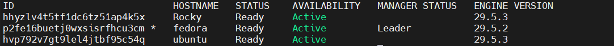
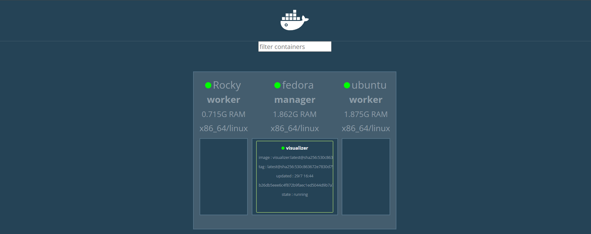
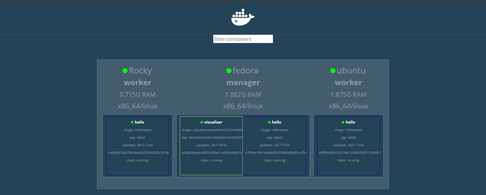
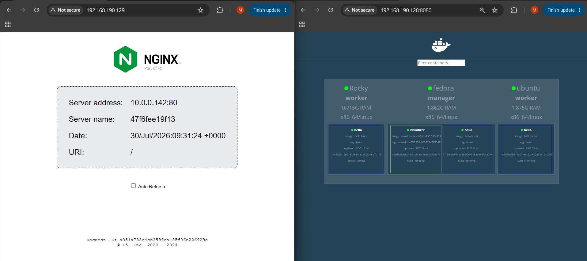
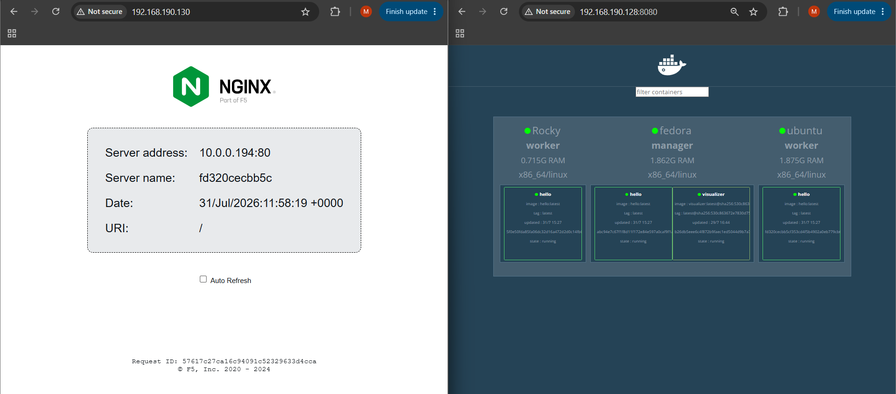
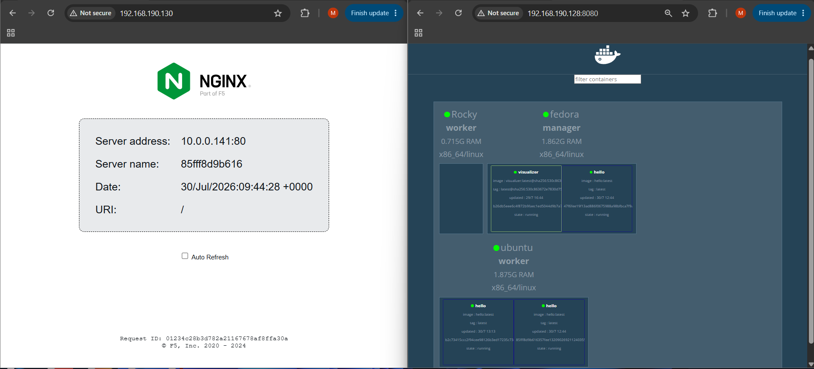
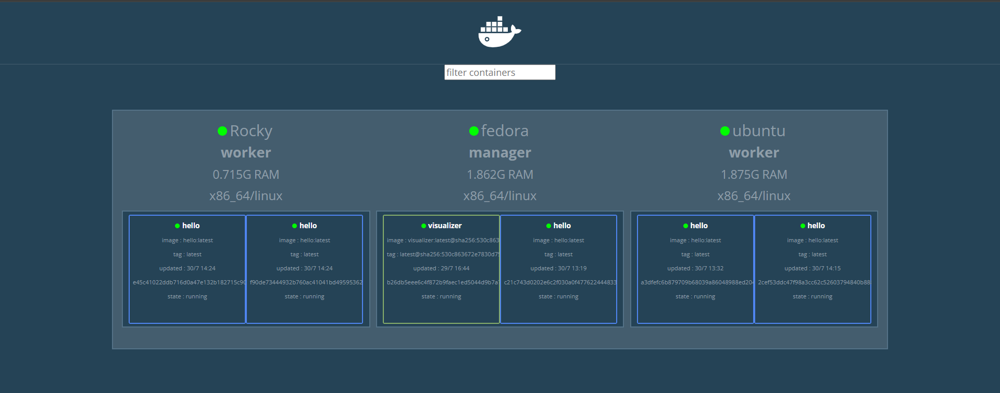
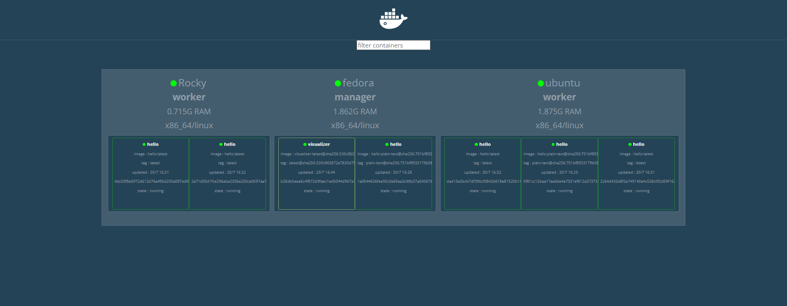
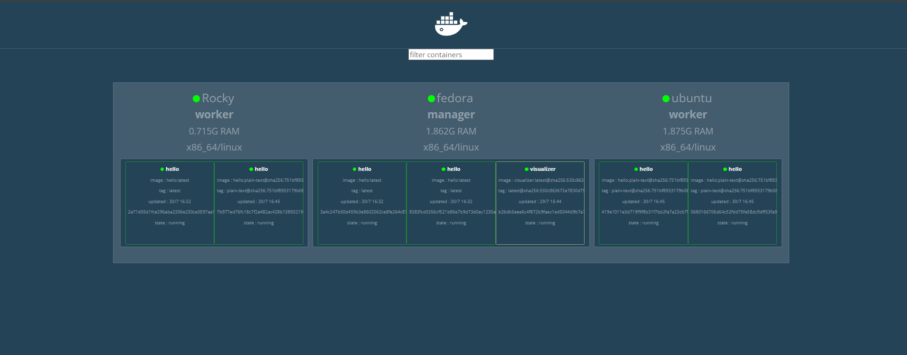

# Docker Swarm Cluster

<p align="center">


</p>

A hands-on Docker Swarm project demonstrating container orchestration, service deployment, overlay networking, routing mesh, high availability, rolling updates, rollback, and Docker Stack deployment across a three-node cluster.

---

# Table of Contents

- [Overview](#overview)
- [Features](#features)
- [Architecture](#architecture)
- [Lab Environment](#lab-environment)
- [Project Structure](#project-structure)
- [Prerequisites](#prerequisites)
- [Building the Swarm Cluster](#building-the-swarm-cluster)
- [Docker Swarm Visualizer](#docker-swarm-visualizer)
- [Creating the Overlay Network](#creating-the-overlay-network)
- [Deploying the Hello Service](#deploying-the-hello-service)
- [Docker Swarm Routing Mesh](#docker-swarm-routing-mesh)
- [High Availability](#high-availability)
- [Scaling the Service](#scaling-the-service)
- [Rolling Updates](#rolling-updates)
- [Rollback](#rollback)
- [Deploying with Docker Stack](#deploying-with-docker-stack)
- [Troubleshooting](#troubleshooting)
- [Cleanup](#cleanup)
- [Key Takeaways](#key-takeaways)
- [License](#license)

---

# Overview

Docker Swarm is Docker's native container orchestration platform. It enables multiple Docker hosts to operate as a single cluster, providing built-in features such as service scheduling, overlay networking, high availability, rolling updates, and declarative application deployment.

This project demonstrates the complete lifecycle of deploying and managing a Docker Swarm cluster using three Linux virtual machines. Throughout the project, services are deployed, scaled, updated, rolled back, and finally managed using Docker Stack.

Rather than focusing only on individual Docker commands, this repository emphasizes the operational concepts behind Docker Swarm while providing reproducible deployment steps.

---

# Features

- Deploy a three-node Docker Swarm cluster
- Configure manager and worker nodes
- Deploy the Docker Swarm Visualizer
- Create and use overlay networks
- Deploy replicated services
- Demonstrate Docker Swarm Routing Mesh
- Simulate node failure using Drain mode
- Automatically reschedule workloads
- Scale services dynamically
- Perform rolling updates
- Roll back service deployments
- Deploy applications using Docker Stack
- Observe service placement with the Swarm Visualizer

---

# Architecture


---

# Lab Environment

| Component | Details |
|-----------|---------|
| Hypervisor | VMware Workstation |
| Manager Node | Fedora Server (2 vCPU, 2 GB RAM) |
| Worker Node 1 | Ubuntu Server (2 vCPU, 2 GB RAM) |
| Worker Node 2 | Rocky Linux Minimal (1 vCPU, 1 GB RAM) |
| Container Runtime | Docker Engine |
| Orchestrator | Docker Swarm |
| Demo Application | nginxdemos/hello |
| Visualization | Docker Swarm Visualizer |

---

# Project Structure

```text
docker-swarm-cluster/
├── stack/
│   └── hello-stack.yml
├── docs/
│   ├── diagrams/
│   │   ├── swarm-architecture.svg
│   │   ├── routing-mesh.svg
│   │   ├── high-availability.svg
│   │   └── deployment-models.svg
│   └── screenshots/
│       ├── 01-swarm-cluster.png
│       ├── 02-visualizer.png
│       ├── 03-hello-service.png
│       ├── 04-routing-mesh.png
│       ├── 05-before-drain.png
│       ├── 06-after-drain.png
│       ├── 07-service-scaling.png
│       ├── 08-rolling-update.png
│       ├── 09-service-rollback.png
│       └── 10-docker-stack.png
├── LICENSE
└── README.md
```

---

# Prerequisites

Before starting this project, ensure the following requirements are met:

- Three Linux virtual machines
- Docker Engine installed on all nodes
- Passwordless or administrative access to each machine
- Network connectivity between all nodes
- Basic familiarity with Docker commands

Verify Docker installation:

```bash
docker --version
```

Verify Docker is running:

```bash
systemctl status docker
```

If Docker is not running, start and enable the service:

```bash
sudo systemctl enable --now docker
```

---

# Building the Swarm Cluster

This section initializes a Docker Swarm cluster consisting of one manager node and two worker nodes.

The **Fedora** virtual machine acts as the cluster manager, while **Ubuntu** and **Rocky Linux** join the cluster as worker nodes.

---

## Step 1 - Initialize the Manager Node

Run the following command on the **Fedora** server.

```bash
docker swarm init
```

Docker initializes the Swarm cluster and displays a join command similar to:

```text
docker swarm join \
--token SWMTKN-xxxxxxxxxxxxxxxx \
192.168.x.x:2377
```

The generated token allows worker nodes to securely join the cluster.

> 📸 **Screenshot 1**  

---

## Step 2 - Retrieve the Worker Join Token

If the original join command is no longer available, generate a new one:

```bash
docker swarm join-token worker
```

Docker prints a new worker join command that can be executed on additional worker nodes.

---

## Step 3 - Join the Worker Nodes

Execute the generated join command on both worker machines.

Ubuntu:

```bash
docker swarm join \
--token <worker-token> \
<manager-ip>:2377
```

Rocky Linux:

```bash
docker swarm join \
--token <worker-token> \
<manager-ip>:2377
```

After joining successfully, each node reports:

```text
This node joined a swarm as a worker.
```

---

## Step 4 - Verify the Cluster

Return to the manager node and verify that all nodes have joined successfully.

```bash
docker node ls
```

Example output:

```text
HOSTNAME   STATUS   AVAILABILITY   MANAGER STATUS

fedora     Ready    Active         Leader
ubuntu     Ready    Active
Rocky      Ready    Active
```

All three nodes should report a **Ready** status.

---

# Docker Swarm Visualizer

The Docker Swarm Visualizer provides a graphical representation of the cluster.

Throughout this project it is used to observe:

- node membership,
- service placement,
- replica distribution,
- task rescheduling,
- scaling operations.

---

## Deploy the Visualizer

Create the Visualizer service on the manager node.

```bash
docker service create \
  --name visualizer \
  --publish 8080:8080 \
  --constraint node.role==manager \
  --mount type=bind,src=/var/run/docker.sock,dst=/var/run/docker.sock \
  dockersamples/visualizer:stable
```

Using a placement constraint ensures that the Visualizer always runs on the manager node.

---

## Verify the Deployment

Check the service status.

```bash
docker service ls
```

Inspect the running task.

```bash
docker service ps visualizer
```

Open a web browser and navigate to:

```text
http://<manager-ip>:8080
```

The Docker Swarm Visualizer should display the three-node cluster.

> 📸 **Screenshot 2**  

---

## Troubleshooting

If the Visualizer service repeatedly enters the **Rejected** state with an image-related error:

```text
No such image: dockersamples/visualizer:latest
```

Pull the supported image manually:

```bash
docker pull dockersamples/visualizer:stable
```

Then remove and recreate the service using the `stable` image tag.

---

# Creating the Overlay Network

Docker Swarm uses **overlay networks** to enable secure communication between containers running on different nodes.

The Hello service in this project uses a dedicated overlay network named **swarm-net**.

---

## Create the Network

Create an attachable overlay network.

```bash
docker network create \
    --driver overlay \
    --attachable \
    swarm-net
```

---

## Verify the Network

List the available Docker networks.

```bash
docker network ls
```

Example output:

```text
NETWORK ID      NAME        DRIVER     SCOPE

xxxxxxxxxxxx    swarm-net   overlay    swarm
```

Inspect the network configuration.

```bash
docker network inspect swarm-net
```

---

# Deploying the Hello Service

The demo application used throughout this project is **nginxdemos/hello**.

It provides a simple web page displaying useful runtime information such as the container hostname, server address, request headers, and client IP, making it ideal for demonstrating Docker Swarm scheduling and networking.

---

## Create the Service

Deploy the service with three replicas.

```bash
docker service create \
    --name hello \
    --replicas 3 \
    --network swarm-net \
    --publish 80:80 \
    nginxdemos/hello
```

Docker Swarm distributes the replicas across the cluster according to its scheduling decisions.

---

## Verify the Service

Check the deployment status.

```bash
docker service ls
```

Example output:

```text
NAME      MODE         REPLICAS

hello     replicated   3/3
```

Display the running tasks.

```bash
docker service ps hello
```

---

## Inspect the Service

Display the service configuration.

```bash
docker service inspect --pretty hello
```

The formatted output includes information such as:

- service mode,
- replica count,
- published ports,
- connected networks,
- container image.

---

## Verify in the Browser

Open a web browser.

```text
http://<manager-ip>
```

The Hello application should be displayed.

Refresh the page several times to observe changes in the reported container hostname when different replicas handle the request.

> 📸 **Screenshot 3**  


---

# Docker Swarm Routing Mesh

When a service publishes a port, Docker Swarm exposes that port on **every node** in the cluster.

Requests can be sent to any node, and Docker Swarm automatically forwards the traffic to an available service replica.


---

## Demonstrate the Routing Mesh

Open the application using each node's IP address.

```text
http://<fedora-ip>

http://<ubuntu-ip>

http://<rocky-ip>
```
i
Although requests enter through different machines, Docker Swarm routes them transparently to available replicas.

Refresh each page several times while observing the Visualizer.

> 📸 **Screenshot 4**  


---

## Verify Replica Placement

Display the service tasks.

```bash
docker service ps hello
```

Compare the running tasks with the Visualizer to observe how Docker Swarm distributes replicas across the cluster.

---

# High Availability

One of Docker Swarm's core features is its ability to maintain service availability when cluster nodes become unavailable.

In this section, a worker node is placed into **Drain** mode to simulate a node becoming unavailable. Docker Swarm automatically reschedules the affected task while keeping the service running.

---

## Drain the Rocky Worker

Run the following command on the **Fedora** manager node.

```bash
docker node update --availability drain Rocky
```

---

## Verify the Node Status

Check the status of all cluster nodes.

```bash
docker node ls
```

Example output:

```text
HOSTNAME   STATUS   AVAILABILITY   MANAGER STATUS

fedora     Ready    Active         Leader
ubuntu     Ready    Active
Rocky      Ready    Drain
```

---

## Verify Task Rescheduling

Inspect the service tasks.

```bash
docker service ps hello
```

Docker Swarm automatically replaces the task that was running on the drained node by scheduling a new replica on one of the remaining active nodes.

---

## Verify Service Availability

Open the Hello application using the **Rocky** node's IP address.

```text
http://<Rocky-ip>
```

Although Rocky is no longer running a service replica, the application remains accessible through Docker Swarm's Routing Mesh.

> 📸 **Screenshot 5**  


> 📸 **Screenshot 6**  


---

## Restore the Node

Return the worker to active scheduling.

```bash
docker node update --availability active Rocky
```

Verify the change.

```bash
docker node ls
```

Ubuntu should once again report:

```text
AVAILABILITY

Active
```

---

# Scaling the Service

Docker Swarm makes it easy to adjust the number of running service replicas.

---

## Scale Up

Increase the number of replicas from **3** to **5**.

```bash
docker service scale hello=5
```

---

## Verify the Deployment

Check the service status.

```bash
docker service ls
```

Expected output:

```text
NAME      MODE         REPLICAS

hello     replicated   5/5
```

Inspect the running tasks.

```bash
docker service ps hello
```

Refresh the Docker Swarm Visualizer to observe the updated replica distribution.

> 📸 **Screenshot 7**  


---

## Scale Down

Restore the service to its original size.

```bash
docker service scale hello=3
```

Verify:

```bash
docker service ls
```

Expected output:

```text
NAME      MODE         REPLICAS

hello     replicated   3/3
```

---

# Rolling Updates

Docker Swarm updates services incrementally, replacing running tasks one at a time according to the configured update policy. This minimizes downtime while deploying a new service version.

---

## Perform a Rolling Update

Update the Hello service.

```bash
docker service update \
    --update-parallelism 1 \
    --update-delay 10s \
    --image nginxdemos/hello:latest \
    hello
```

The update policy instructs Docker Swarm to:

- update one replica at a time,
- wait 10 seconds before updating the next replica.

---

## Monitor the Update

Display the service tasks.

```bash
docker service ps hello
```

As the update progresses, old tasks are replaced with new ones until every replica has been updated.

Refresh the Docker Swarm Visualizer to observe the rolling update.

> 📸 **Screenshot 8**  


---

# Rollback

If a deployment introduces a problem, Docker Swarm can restore the previous service specification with a single command.

---

## Roll Back the Service

Run:

```bash
docker service rollback hello
```

---

## Verify the Rollback

Monitor the rollback process.

```bash
docker service ps hello
```

Verify that the service has returned to its previous state.

```bash
docker service ls
```

Expected output:

```text
NAME      MODE         REPLICAS

hello     replicated   3/3
```

Refresh the Docker Swarm Visualizer to observe the rollback.

> 📸 **Screenshot 9**  


---

# Deploying with Docker Stack

So far, the Hello service has been managed using individual Docker Swarm commands.

Docker Stack provides a declarative approach by defining the desired application state in a YAML file.

---

## Remove the Existing Service

Before deploying the stack, remove the manually created service.

```bash
docker service rm hello
```

Verify that the service has been removed.

```bash
docker service ls
```

---

## Stack Configuration

The stack definition is stored in:

```text
stack/hello-stack.yml
```

```yaml
services:
  hello:
    image: nginxdemos/hello
    networks:
      - swarm-net

    ports:
      - "80:80"

    deploy:
      replicas: 3

networks:
  swarm-net:
    external: true
```

---

## Deploy the Stack

Deploy the application.

```bash
docker stack deploy \
    -c stack/hello-stack.yml \
    hello
```

---

## Verify the Deployment

Display the deployed stacks.

```bash
docker stack ls
```

Display the services created by the stack.

```bash
docker stack services hello
```

Display the running tasks.

```bash
docker stack ps hello
```

The Hello service should once again be running with three replicas.

Refresh the Docker Swarm Visualizer to verify the deployment.

> 📸 **Screenshot 10**  

---

# Troubleshooting

## Visualizer Service Fails to Start

### Problem

The Visualizer service repeatedly enters the **Rejected** state.

Example:

```text
No such image: dockersamples/visualizer:latest
```

### Solution

Pull the supported image manually.

```bash
docker pull dockersamples/visualizer:stable
```

Remove the failed service and deploy it again using the `stable` image tag.

---

## Worker Cannot Join the Swarm

### Possible Causes

- Incorrect join token
- Incorrect manager IP address
- Port **2377/TCP** is blocked
- Docker service is not running

### Solution

Generate a new worker join command.

```bash
docker swarm join-token worker
```

Verify connectivity between the manager and worker nodes before attempting to join again.

---

## Verify Cluster Health

Useful diagnostic commands:

```bash
docker node ls
docker service ls
docker service ps hello
docker stack ls
docker stack services hello
```

---

# Cleanup

Remove the Docker Stack.

```bash
docker stack rm hello
```

Remove the Visualizer service.

```bash
docker service rm visualizer
```

Remove the overlay network.

```bash
docker network rm swarm-net
```

Leave the Swarm cluster on each worker node.

```bash
docker swarm leave
```

Finally, leave the Swarm on the manager.

```bash
docker swarm leave --force
```

---

# Key Takeaways

By completing this project, you have learned how to:

- Initialize a Docker Swarm cluster
- Join worker nodes to an existing Swarm
- Deploy replicated services
- Create overlay networks
- Use the Docker Swarm Visualizer
- Understand Docker Swarm Routing Mesh
- Demonstrate high availability using Drain mode
- Scale services dynamically
- Perform rolling updates
- Roll back service deployments
- Deploy applications using Docker Stack

---

# License

This project is licensed under the MIT License.

See the [LICENSE](LICENSE) file for details.
